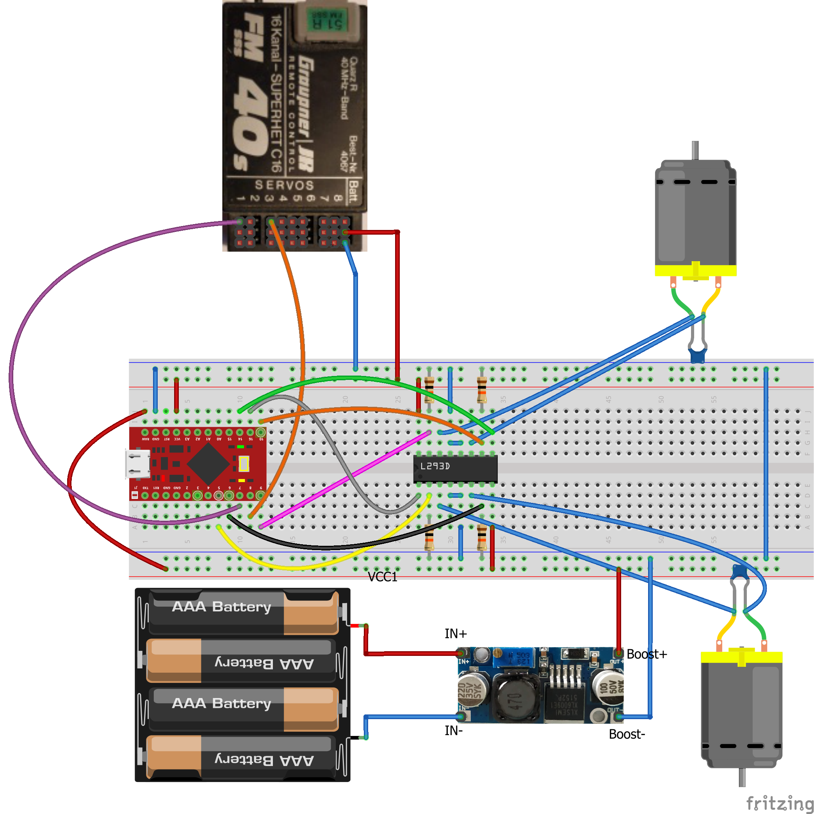

# RC-ESC
This project is able to control an RC-car with an old plane remote.
The RC car died a horrible death of Childhood torture and loosing its remote.
Therefore an Arduino, and an old plane Remote come to the rescue to help it live again.

This project uses an Graupner FM 314 40 MHz Remote and a Graupner FM SSS 40S receiver
Currently it is using an Arduino Pro Micro 5 V clone to test it out and
drive two motors of a stunt rc car ( tank style ).

Schematic
-------------------------

Development Environment
------------------------
For development the Platformio IDE is used. Best way to get started is the following:

* Install [Visual Studio Code](https://code.visualstudio.com/)

* Install the [Platformio extension](https://marketplace.visualstudio.com/items?itemName=platformio.platformio-ide)

Clone the repository:

    git@github.com:DonPavlov/rc-esc.git

Open the Folder containg the platformio.ini in Visual Studio Code.

Troubleshooting
------------------------
Ubuntu:
* Upload is not successfull although the correct port is enabled.

Do the following:

    sudo systemctl stop ModemManager.service
